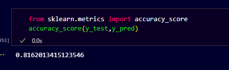

# 🏏 IPL Win Predictor - AI-Powered Cricket Analytics Dashboard

Welcome to the **IPL Win Predictor**, a machine learning-powered web app that predicts the chances of a batting team winning based on live match conditions like score, overs left, wickets lost, and more.

> 🎯 Built with Streamlit, Plotly, Scikit-learn, and Pandas  
> 💡 Accuracy: ~81.62%  
> 👨‍💻 Created by Kishan Yadav

---

## 🚀 Features

- 🔮 Predicts match outcome based on real-time match inputs
- 📈 Live metrics: Run Rate, Required Run Rate, Wickets, Overs
- 📊 Beautiful interactive graphs using Plotly
- 💾 Trained ML pipeline using Scikit-learn and joblib
- 🌐 Deployed with Streamlit Cloud

---

## 📸 App Preview



---

## 🧠 Model Details

- **Model:** Random Forest Classifier
- **Training Features:**  
  `runs_left`, `balls_left`, `wickets`, `total_runs`, `crr`, `rrr`
- **Target:** Win Probability (1 = Win, 0 = Lose)
- **Accuracy:** ~81.62% on test data

---

## 📦 Tech Stack

| Tool         | Purpose                  |
|--------------|---------------------------|
| Streamlit    | Frontend Web Interface   |
| Scikit-learn | ML Model (Random Forest) |
| Joblib       | Model Serialization      |
| Pandas       | Data Manipulation        |
| Plotly       | Interactive Charts       |

---

## 🛠️ How to Run Locally

### 1. Clone the repository

```bash
git clone https://github.com/your-username/ipl-win-predictor.git
cd ipl-win-predictor

pip install -r requirements.txt

.
├── app.py              # Streamlit app
├── pipe.pkl            # Trained ML model
├── proof.png           # Accuracy proof image
├── requirements.txt    # Required Python libraries
└── README.md           # Project overview

